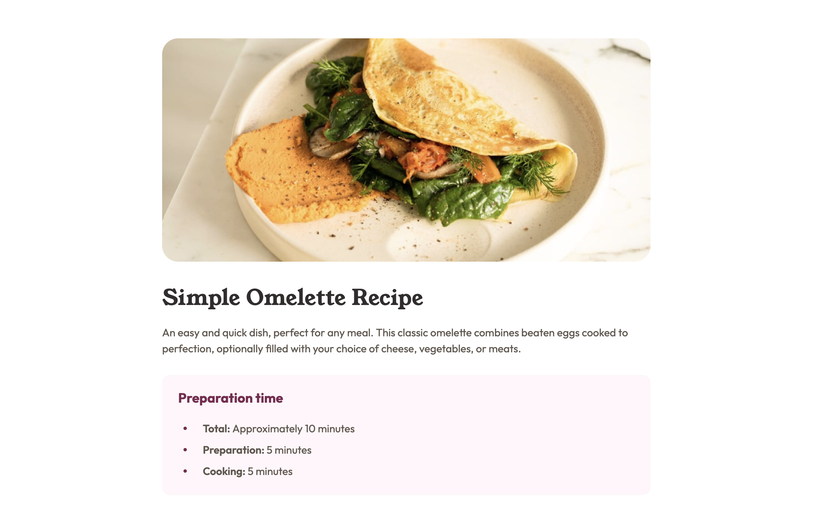

# Frontend Mentor - Recipe page solution

This is a solution to the [Recipe page challenge on Frontend Mentor](https://www.frontendmentor.io/challenges/recipe-page-KiTsR8QQKm).

## Table of contents

- [Overview](#overview)
  - [The challenge](#the-challenge)
  - [Screenshot](#screenshot)
  - [Links](#links)
- [My process](#my-process)
  - [Built with](#built-with)
  - [What I learned](#what-i-learned)
  - [Continued development](#continued-development)
  - [Useful resources](#useful-resources)
- [Author](#author)
- [Acknowledgments](#acknowledgments)

## Overview

### The Challenge

Build out a recipe page based on the design files provided. Focus on writing with semantic HTML that is most appropriate for each piece of content.

### Screenshot

### Links

- Solution URL: [Github](https://github.com/willdelorm/recipe-page)
- Live Site URL: [Github Pages](https://willdelorm.github.io/recipe-page)

## My process

### Built with

- Semantic HTML5 markup
- CSS custom properties
- Mobile-first workflow

### What I learned

On this challenge, I opted to use as few class names as possible and stuck to styling based on the HTML elements. This forced me to use pseudo-classes to isolate the last child or every child besides the last one.

I also learned how to re-create the numbers of an ordered list using the pseudo-element `::before` and the CSS properties `counter-reset` and `counter-increment`. It's nice to find that CSS has a way to do this without involving JavaScript.

### Continued development

I'd like to continue learning to use pseudo-classes and -elements in more situations.

### Useful resources

- [W3S Table Styles](https://www.w3schools.com/Css/css_table.asp) - I had to review styling tables, specifically adding the borders in-between rows
- [W3S Pseudo Elements](https://www.w3schools.com/Css/css_pseudo_elements.asp) - I always need to reference how to use pseudo elements since I don't use them enough. Glad to find a relatively simple way to customize bullet points!

## Author

- Website - [Will Delorm](https://willdelorm.com)
- Frontend Mentor - [@willdelorm](https://www.frontendmentor.io/profile/willdelorm)
